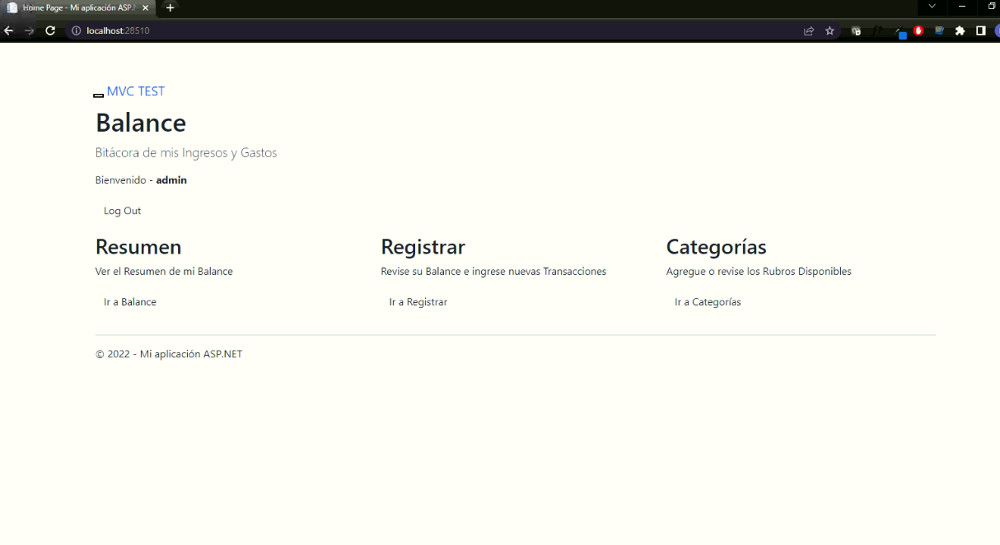
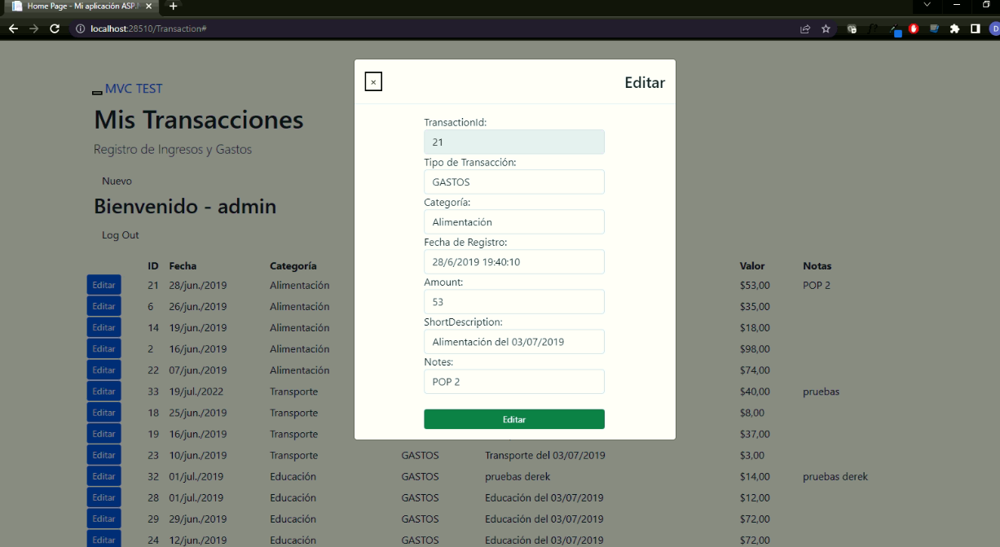

## Table of Contents
1. [General Info](#general-info)
2. [Installation](#Installation)
3. [Screenshot](#Screenshot)
4. [Mer](#Mer)

## General Info
***
El proyecto contiene el desarrollo del proyecto.

## Installation
***
Pequeñas recomendaciones para instalar el proyecto. 
```
1. Puede instalar el archivo .bak para cargar la base de datos o ejecutar el script sobre la base de datos nueva.
2. Ejecutar y probar el aplicativo.
```

### Screenshot
***
Imagenes del proyecto
```







```

### MER
***
Modelo Entidad Relación del Proyecto
```

```
